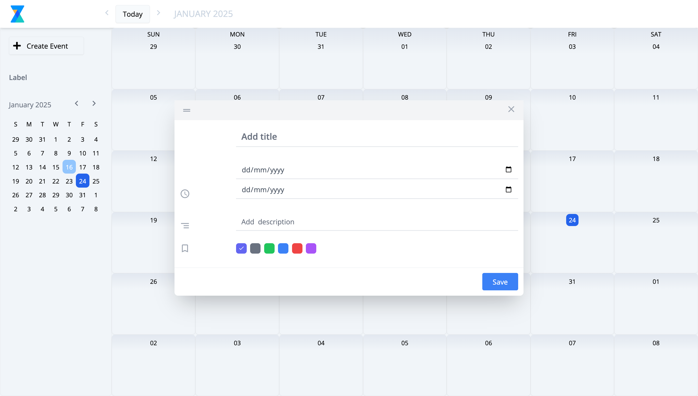

# Google Calendar Clone

A Google Calendar-inspired application built with modern web technologies like React, React Context, and Tailwind CSS. The app provides users with an intuitive and responsive interface for managing events and schedules efficiently.



---

## 🌟 Features

- **Event Management**: Create, edit, and delete events.
- **Calendar Views**: Switch seamlessly between daily, weekly, and monthly views.
- **Responsive Design**: Optimized for devices of all sizes using Tailwind CSS.
- **State Management**: Robust global state handling with React Context.
- **Date Manipulation**: Efficient date formatting and handling using Day.js.

---

## 🔧 Tech Stack

- **Frontend**: React, Redux Toolkit
- **Styling**: Tailwind CSS
- **Build Tool**: Vite
- **Utilities**: Day.js
- **Linting**: ESLint

---

## 🚀 Getting Started

### Prerequisites

Ensure you have the following installed on your system:

- **Node.js** (v16.x or later)
- **npm** (v8.x or later)

### Installation

1. Clone the repository:
   ```bash
   git clone https://github.com/the-kumar-amit07/google-calendar-clone.git
   cd google-calendar-clone
   ```

2. Install dependencies:
   ```bash
   npm install
   ```

3. Start the development server:
   ```bash
   npm run dev
   ```

4. Open your browser and navigate to:
   ```
   http://localhost:5173
   ```

### Build for Production

To build the application for production, run:
```bash
npm run build
```

Preview the production build locally:
```bash
npm run preview
```

---


## 📜 Scripts

| Command             | Description                               |
|---------------------|-------------------------------------------|
| `npm run dev`       | Starts the development server.            |
| `npm run build`     | Builds the application for production.    |
| `npm run preview`   | Previews the production build locally.    |
| `npm run lint`      | Runs ESLint to lint the code.             |

---

## 📦 Dependencies

### Production

- **React**: Library for building user interfaces.
- **Context Api**: State management solution.
- **Day.js**: Lightweight library for date manipulation.

### Development

- **Vite**: Fast development build tool.
- **Tailwind CSS**: Utility-first CSS framework.
- **ESLint**: JavaScript/React linting tool.
- **PostCSS**: Tool for processing CSS.

---

## 🤝 Contributing

Contributions are welcome! To contribute:

1. Fork the repository.
2. Create a new branch (`git checkout -b feature/your-feature`).
3. Commit your changes (`git commit -m 'Add a new feature'`).
4. Push to the branch (`git push origin feature/your-feature`).
5. Open a pull request.

---


## 📧 Contact

For inquiries or feedback, please contact (mailto:amitkumarmarndi37@gmail.com).
